# Домашнее задание к занятию "`Docker. Часть 2`" - `Чепелев Павел`


**Правила выполнения заданий к занятию «6.4. Docker. Часть 2»**

- Все задания выполняйте на основе [конфигов](https://github.com/netology-code/sdvps-homeworks/tree/main/lecture_demos/6-04) из лекции. 
- В заданиях описаны те параметры, которые необходимо изменить. 
- Если параметр не упомянут вообще, значит, его нужно оставить таким, какой он был в лекции. 
- Если в каком-то задании, например, в задании 2, нужно изменить параметр, подразумевается, что во всех следующих заданиях будет использоваться уже изменённый параметр.
- Проверяйте правильность отступов. Очень важно их соблюдать, так как это влияет на структуру данных.
- Выполнив все задания без звёздочки, вы должны получить полнофункциональный сервис.

Любые вопросы по решению задач задавайте в разделе "Вопросы по заданию".

### Дополнительные примеры
Примеры различных композ проектов от разработчиков Docker: [https://github.com/docker/awesome-compose/blob/master/wireguard/compose.yaml](https://github.com/docker/awesome-compose/tree/master)

### Дополнительная документация:
  - [блок networks: в compose](https://docs.docker.com/compose/compose-file/06-networks/)
  - [блок volumes: в compose](https://docs.docker.com/compose/compose-file/07-volumes/)


---

### Задание 1

**Напишите ответ в свободной форме, не больше одного абзаца текста.**

Установите Docker Compose и опишите, для чего он нужен и как может улучшить лично вашу жизнь.

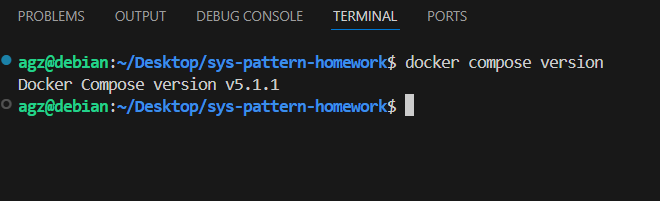
docker compose - это отдельный инструмент, который позволяет управлять многоконтейнерными приложениями с помощью конфигурации yaml. По улучшению жизни, на ум приходят только рабочие задачки которые можно было бы решить с помощью этого инструмента. Например заразвертывание  СУБД для различного ПО используемого у нас в организации
---

### Задание 2 

**Выполните действия и приложите текст конфига на этом этапе.** 

Создайте файл docker-compose.yml и внесите туда первичные настройки: 

 * version;
 * services;
 * volumes;
 * networks.

При выполнении задания используйте подсеть 10.5.0.0/16.
Ваша подсеть должна называться: <ваши фамилия и инициалы>-my-netology-hw.
Все приложения из последующих заданий должны находиться в этой конфигурации.
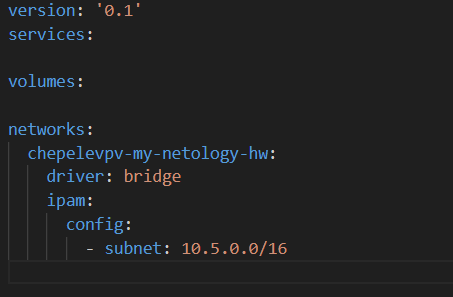

---

### Задание 3 

**Выполните действия:** 

1. Создайте конфигурацию docker-compose для Prometheus с именем контейнера <ваши фамилия и инициалы>-netology-prometheus. 
2. Добавьте необходимые тома с данными и конфигурацией (конфигурация лежит в репозитории в директории [6-04/prometheus](https://github.com/netology-code/sdvps-homeworks/tree/main/lecture_demos/6-04/prometheus) ).
3. Обеспечьте внешний доступ к порту 9090 c докер-сервера.
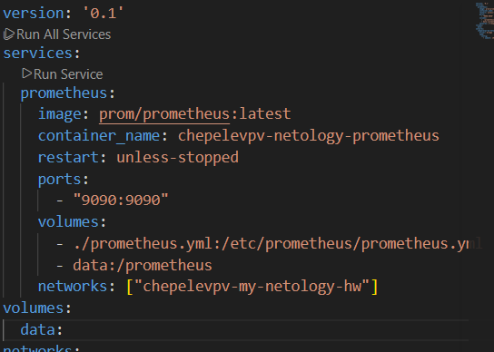
---

### Задание 4 

**Выполните действия:**

1. Создайте конфигурацию docker-compose для Pushgateway с именем контейнера <ваши фамилия и инициалы>-netology-pushgateway. 
2. Обеспечьте внешний доступ к порту 9091 c докер-сервера.
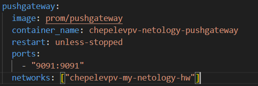
---

### Задание 5 

**Выполните действия:** 

1. Создайте конфигурацию docker-compose для Grafana с именем контейнера <ваши фамилия и инициалы>-netology-grafana. 
2. Добавьте необходимые тома с данными и конфигурацией (конфигурация лежит в репозитории в директории [6-04/grafana](https://github.com/netology-code/sdvps-homeworks/blob/main/lecture_demos/6-04/grafana/custom.ini).
3. Добавьте переменную окружения с путем до файла с кастомными настройками (должен быть в томе), в самом файле пропишите логин=<ваши фамилия и инициалы> пароль=netology.
4. Обеспечьте внешний доступ к порту 3000 c порта 80 докер-сервера.
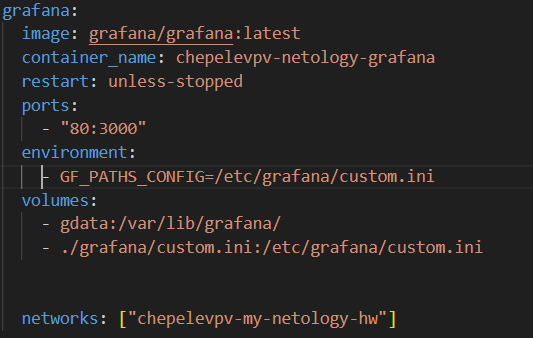
---

### Задание 6 

**Выполните действия.**

1. Настройте поочередность запуска контейнеров.
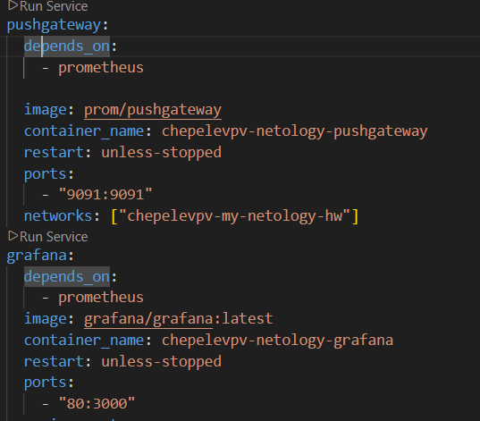
2. Настройте режимы перезапуска для контейнеров.
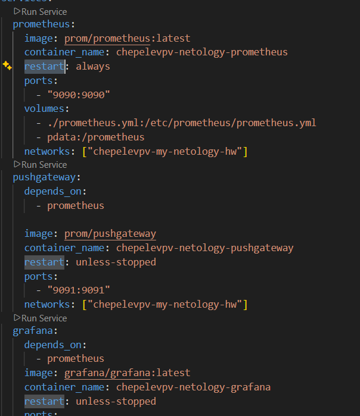
3. Настройте использование контейнерами одной сети.
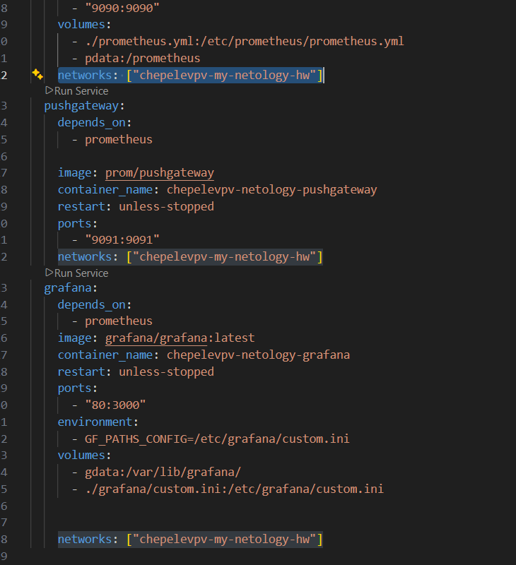
4. Запустите сценарий в detached режиме.
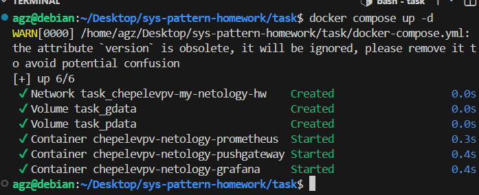

---

### Задание 7 

**Выполните действия.**
1. Выполните запрос в Pushgateway для помещения метрики <ваши фамилия и инициалы> со значением 5 в Prometheus: ```echo "<ваши фамилия и инициалы> 5" | curl --data-binary @- http://localhost:9091/metrics/job/netology```.
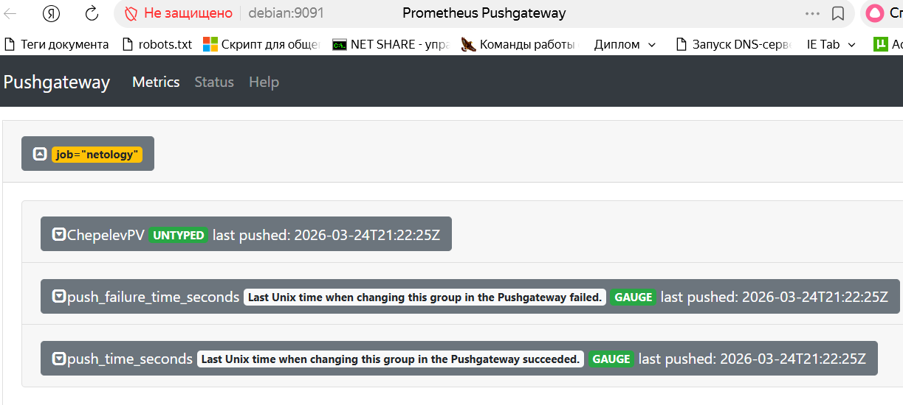
2. Залогиньтесь в Grafana с помощью логина и пароля из предыдущего задания.
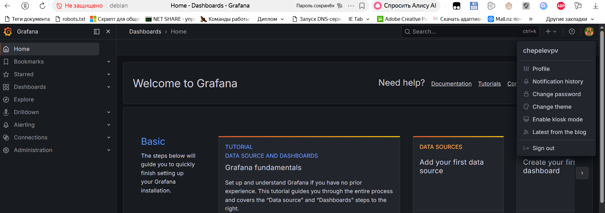
3. Cоздайте Data Source Prometheus (Home -> Connections -> Data sources -> Add data source -> Prometheus -> указать "Prometheus server URL = http://prometheus:9090" -> Save & Test).
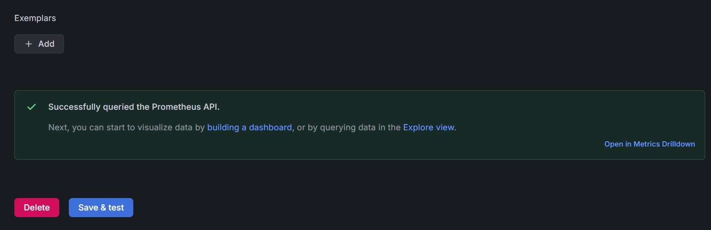
4. Создайте график на основе добавленной в пункте 5 метрики (Build a dashboard -> Add visualization -> Prometheus -> Select metric -> Metric explorer -> <ваши фамилия и инициалы -> Apply.
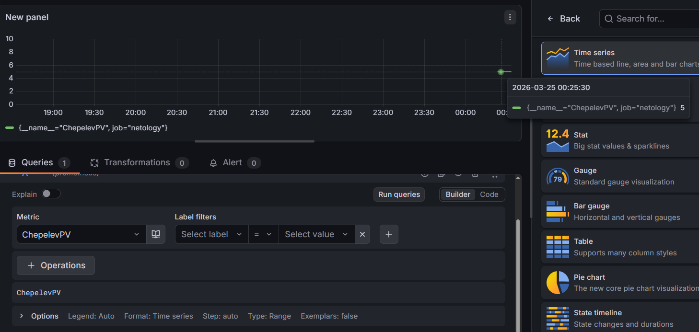

В качестве решения приложите:

* docker-compose.yml **целиком**;
[docker-compose.yml](https://github.com/AnGraizzZ/sys-pattern-homework/blob/main/task/docker-compose.yml)
* скриншот команды docker ps после запуске docker-compose.yml;
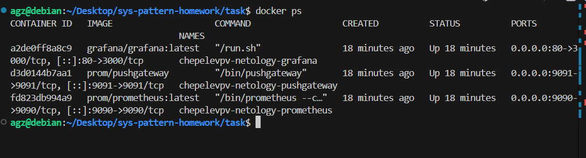
* скриншот графика, постоенного на основе вашей метрики.

---

### Задание 8

**Выполните действия:** 

1. Остановите и удалите все контейнеры одной командой.

В качестве решения приложите скриншот консоли с проделанными действиями.
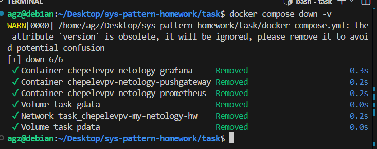
---

## Дополнительные задания* (со звёздочкой)

Их выполнение необязательное и не влияет на получение зачёта по домашнему заданию. Можете их решить, если хотите лучше разобраться в материале.

---

### Задание 9* 

**Выполните действия:** 

1. Создайте конфигурацию docker-compose для Alertmanager с именем контейнера <ваши фамилия и инициалы>-netology-alertmanager. 
2. Добавьте необходимые тома с данными и [конфигурацией](https://github.com/netology-code/sdvps-homeworks/tree/main/6-04/alertmanager), сеть, режим и очередность запуска.
3. Обновите конфигурацию Prometheus (необходимые изменения ищите в презентации или документации) и перезапустите его. 
4. Обеспечьте внешний доступ к порту 9093 c докер-сервера.

В качестве решения приложите скриншот с событием из Alertmanager.

---

### Задание 10* 

Запустите свой сценарий на чистом железе без предзагруженных образов.

**Ответьте на вопросы в свободной форме:**

1. Опишите выполненный вами процесс развертывания сценария.
2. Как вы думаете зачем может понадобиться такой способ развертывания?
